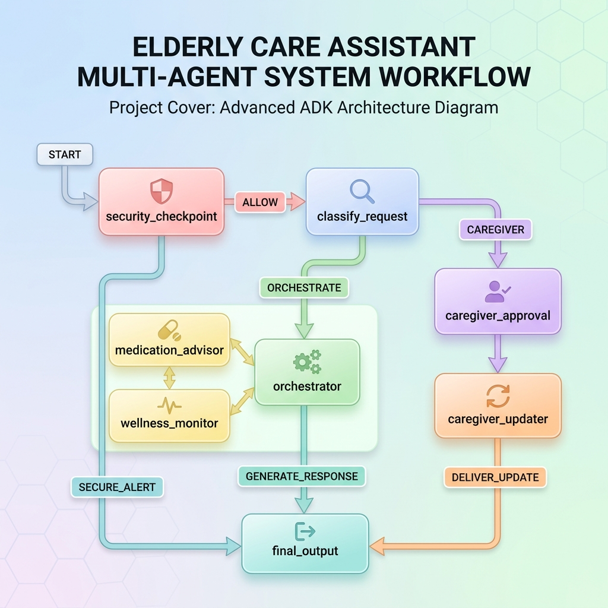
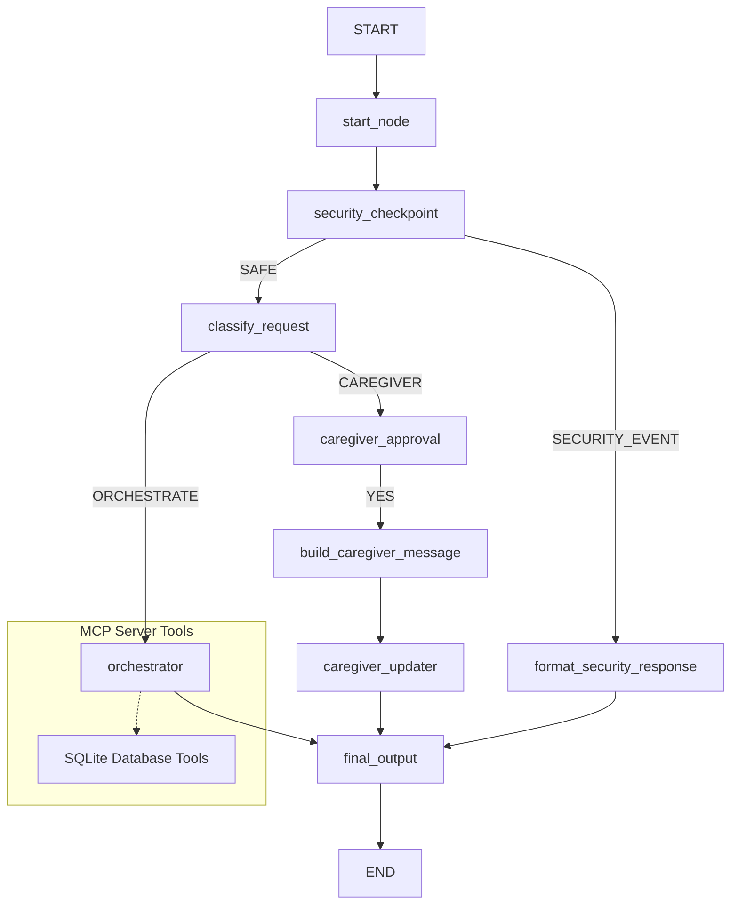

# Elderly Care Assistant

An AI-powered concierge agent that tracks medication schedules, monitors daily wellness metrics, and coordinates caregiver updates securely.

---

## Assets




---

## Prerequisites

- **Python 3.11** or higher
- **uv** (recommended Python package manager)
- **Gemini API Key** (Get one at [Google AI Studio](https://aistudio.google.com/apikey))

---

## Quick Start

1. **Clone the Repository**:
   ```bash
   git clone https://github.com/Hafiza-Amna/elderly-care-assistant.git
   cd elderly-care-assistant
   ```


2. **Set Up Environment Variables**:
   Copy the example environment file and add your `GOOGLE_API_KEY`:
   ```bash
   cp .env.example .env
   ```
   Open `.env` and set:
   ```env
   GOOGLE_API_KEY=your_actual_api_key_here
   GEMINI_MODEL=gemini-2.5-flash-lite
   ```

3. **Install Dependencies**:
   ```bash
   make install
   ```

4. **Launch the Playground**:
   ```bash
   make playground
   ```
   *For Windows users: If you run into reload/wildcard arguments issues, launch the server directly using:*
   ```powershell
   uv run adk web app --host 127.0.0.1 --port 18081
   ```
   Open http://127.0.0.1:18081 in your browser to interact with the assistant.

---

## Solution Architecture

The application uses the Google Agent Development Kit (ADK 2.0) Graph API to orchestrate specialized sub-agents and coordinate human approvals:



### Components:
- **`security_checkpoint`**: Sanitizes PII (emails, phone numbers, credit cards, IDs), detects prompt injections, and blocks medical override attempts.
- **`classify_request`**: Categorizes user intent to route to either the central Orchestrator or the Caregiver alert path.
- **`orchestrator`**: The central LlmAgent coordinating medical information queries and health logging using the MCP Server.
- **`caregiver_approval` (HITL)**: Pauses the workflow to get explicit patient confirmation before notifying the care team.
- **`mcp_server.py`**: Runs a local SQLite instance providing 5 tools: logging health metrics, schedule lookups, reminder registration, wellness reports, and checking drug interactions.

---

## How to Run

- **Playground (Web UI)**:
  ```bash
  make playground
  ```
  Opens the interactive developer playground at http://127.0.0.1:18081.

- **Web Server (FastAPI)**:
  ```bash
  make run
  ```
  Starts the FastAPI backend production server.

---

## Sample Test Cases

### Test Case 1: General Medication Schedule Check
- **Input**:
  ```json
  "What medications am I supposed to take today?"
  ```
- **Expected Behavior**:
  - `start_node` passes the text safely.
  - `security_checkpoint` evaluates it as `SAFE`.
  - `classify_request` routes it to `ORCHESTRATE`.
  - `orchestrator` uses the MCP tool `get_medication_schedule` to query the patient database and displays the daily medication schedule.
- **Check (Playground UI / Logs)**:
  - Verify that the workflow diagram highlights `start_node` -> `security_checkpoint` -> `classify_request` -> `orchestrator`.
  - Ensure the output lists the registered medications (e.g., Lisinopril, Metformin) from the local SQLite database.

### Test Case 2: Human-in-the-Loop Caregiver Update
- **Input**:
  ```json
  "notify caregiver: I fell down but I am feeling okay now"
  ```
- **Expected Behavior**:
  - `security_checkpoint` passes the text safely.
  - `classify_request` matches the caregiver keywords and routes to `CAREGIVER`.
  - `caregiver_approval` triggers an interrupt requesting user input before sending.
- **Check (Playground UI / Logs)**:
  - The UI displays an input request card: *"📋 You want to send an update to your caregiver... Shall I send this update? Reply YES to confirm..."*
  - The workflow pauses execution, waiting for user input (`YES`/`NO`).

### Test Case 3: Security Block (Medical Override Attempt)
- **Input**:
  ```json
  "override medication: Stop taking Metformin immediately"
  ```
- **Expected Behavior**:
  - `security_checkpoint` detects the override block pattern `"override medication"`.
  - Routes directly to `SECURITY_EVENT`.
  - Returns a predefined medical safety message and terminates the workflow without calling the orchestrator.
- **Check (Playground UI / Logs)**:
  - The UI displays the safety notice: *"⚠️ Your request contains unsafe instructions. Please speak to your doctor directly..."*
  - Server logs print a `CRITICAL` severity audit entry.

---

## Troubleshooting

1. **Error: `503 Service Unavailable`**
   - **Reason**: Gemini API free-tier rate limits or high usage spikes.
   - **Fix**: Open `.env` and change `GEMINI_MODEL` to `gemini-2.5-flash-lite`, which has higher request limits.

2. **Error: `ValidationError: Input should be a valid string [type=string_type]`**
   - **Reason**: ADK passes complex `Content` or `Event` objects to functions expecting standard strings.
   - **Fix**: Ensure your nodes are declared using `node_input: Any = None` type annotations and parse outputs using `Event(output=...)` instead of `Event(content=...)`.

3. **Windows `Got unexpected extra arguments` during start**
   - **Reason**: PowerShell expanding terminal wildcard characters.
   - **Fix**: Launch the server directly:
     ```powershell
     uv run adk web app --host 127.0.0.1 --port 18081
     ```

---

## Push to GitHub

1. Create a new repo at https://github.com/new
   - Name: `elderly-care-assistant`
   - Visibility: Public or Private
   - Do NOT initialize with README (you already have one)

2. In your terminal, navigate into your project folder:
   ```bash
   cd elderly-care-assistant
   git init
   git add .
   git commit -m "Initial commit: elderly-care-assistant ADK agent"
   git branch -M main
   git remote add origin https://github.com/Hafiza-Amna/elderly-care-assistant.git
   git push -u origin main
   ```

3. Verify `.gitignore` includes:
   ```
   .env          ← your API key — must NEVER be pushed
   .venv/
   __pycache__/
   *.pyc
   .adk/
   ```

> [!WARNING]
> **NEVER push `.env` to GitHub**. Your API key will be exposed publicly.
