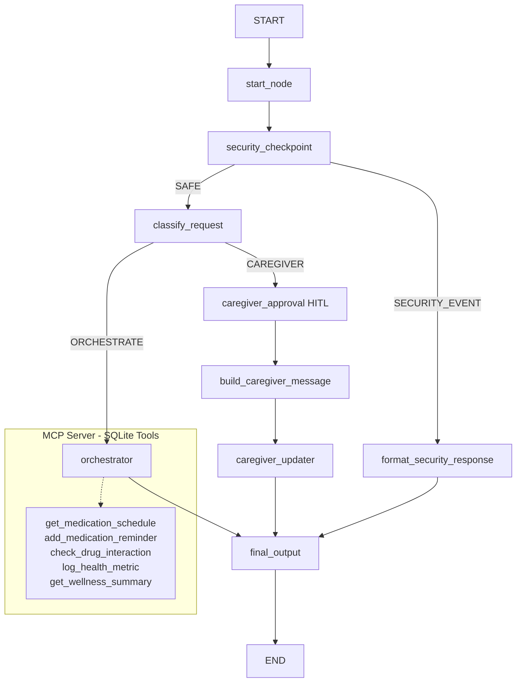

# Elderly Care Assistant AI

An AI-powered elderly care assistant built with **Google Agent Development Kit (ADK)** and powered by **Groq's Llama 3.3 70B** model. The system delivers real-time medication management, wellness monitoring, and caregiver coordination through a secure, multi-agent workflow.

---

## Assets


---

## Features

- **Medication schedule lookup** - Retrieves today's medication plan from the local patient database
- **Drug interaction checking** - Flags potential conflicts between current medications
- **Reminder registration** - Adds new medication reminders to the schedule
- **Wellness monitoring** - Logs health metrics (blood pressure, glucose, weight, mood, pain levels)
- **Wellness reports** - Summarizes health trends and observations over time
- **Caregiver notification workflow** - Composes professional updates for family and care teams
- **Human-in-the-loop (HITL) approval** - Pauses the workflow for explicit patient confirmation before sending caregiver alerts
- **PII sanitization** - Automatically redacts emails, phone numbers, credit card numbers, SSNs, and dates of birth from all inputs
- **Prompt injection detection** - Blocks adversarial instructions designed to subvert the assistant
- **Medical override protection** - Detects and refuses unauthorized medication change attempts

---

## Tech Stack

| Layer | Technology |
|-------|-----------|
| Agent framework | Google Agent Development Kit (ADK) |
| Workflow orchestration | ADK Graph Workflow API |
| LLM provider | Groq - llama-3.3-70b-versatile |
| LLM bridge | LiteLLM |
| Tool protocol | Model Context Protocol (MCP) |
| Web API | FastAPI |
| Patient database | SQLite (local, embedded) |
| Language | Python 3.11+ |

---

## Architecture

The application uses the ADK 2.0 Graph Workflow API to orchestrate a pipeline of function nodes and specialized `LlmAgent` sub-agents:

```
START
  └─► start_node
        └─► security_checkpoint       (PII sanitization + injection detection)
              ├─► [SECURITY_EVENT] format_security_response ─► final_output
              └─► [SAFE] classify_request
                    ├─► [CAREGIVER] caregiver_approval       (HITL pause)
                    │         └─► build_caregiver_message
                    │                   └─► caregiver_updater (LlmAgent)
                    │                             └─► final_output
                    └─► [ORCHESTRATE] orchestrator           (LlmAgent)
                                └─► AgentTools:
                                      ├─► medication_advisor ─► MCP tools
                                      ├─► wellness_monitor   ─► MCP tools
                                      └─► caregiver_updater
                                └─► final_output
```

### Workflow Diagram (Mermaid)



### Workflow Nodes

| Node | Type | Description |
|------|------|-------------|
| `start_node` | Function | Accepts and normalises raw user input |
| `security_checkpoint` | Function | PII scrubbing, injection detection, medical override protection |
| `classify_request` | Function | Routes to ORCHESTRATE or CAREGIVER path |
| `orchestrator` | LlmAgent | Central coordinator; delegates to specialist sub-agents |
| `medication_advisor` | LlmAgent | Medication schedules, reminders, drug interactions via MCP |
| `wellness_monitor` | LlmAgent | Health metric logging and wellness summaries via MCP |
| `caregiver_updater` | LlmAgent | Composes professional caregiver updates |
| `caregiver_approval` | Function (HITL) | Pauses for explicit patient consent before alerting caregivers |
| `build_caregiver_message` | Function | Formats the caregiver notification |
| `final_output` | Function | Returns the structured response to the user |

### MCP Server Tools (SQLite-backed)

| Tool | Description |
|------|-------------|
| `get_medication_schedule` | Retrieve today's medication plan for a patient |
| `add_medication_reminder` | Register a new medication reminder |
| `check_drug_interaction` | Check for interactions between two medications |
| `log_health_metric` | Record a health measurement (BP, glucose, mood, etc.) |
| `get_wellness_summary` | Retrieve a wellness trend report |

---

## Project Structure

```
elderly-care-assistant/
├── app/
│   ├── agent.py                     # Workflow - all nodes, agents, and edges
│   ├── config.py                    # Environment config (GROQ_MODEL, GROQ_API_KEY)
│   ├── mcp_server.py                # FastMCP server with 5 SQLite-backed tools
│   ├── fast_api_app.py              # FastAPI application entry point
│   ├── __init__.py
│   └── app_utils/
│       ├── a2a.py                   # Agent-to-Agent (A2A) protocol routes
│       ├── services.py              # Session and artifact service factory
│       ├── telemetry.py             # OpenTelemetry tracing setup
│       ├── typing.py                # Shared type definitions
│       └── reasoning_engine_adapter.py
├── tests/
│   ├── unit/
│   │   ├── test_groq_migration.py   # Groq config + workflow + security unit tests
│   │   └── test_dummy.py
│   ├── run_e2e_test.py              # End-to-end Groq API verification script
│   ├── eval/
│   └── integration/
├── assets/
│   ├── cover_banner.png
│   └── workflow_diagram.png
├── .env.example                     # Template - copy to .env and fill in your key
├── .gitignore                       # .env is excluded
├── requirements.txt                 # pip-compatible dependency list
├── pyproject.toml                   # uv/pip project metadata
├── uv.lock                          # Locked dependency tree
├── Makefile                         # Dev shortcuts
├── Dockerfile
└── README.md
```

---

## Prerequisites

- **Python 3.11** or higher
- **uv** package manager - install from [https://docs.astral.sh/uv/](https://docs.astral.sh/uv/)
- **Groq API Key** - get one free at [https://console.groq.com/keys](https://console.groq.com/keys)

---

## Installation

**1. Clone the repository:**

```bash
git clone https://github.com/Hafiza-Amna/elderly-care-assistant.git
cd elderly-care-assistant
```

**2. Install dependencies:**

```bash
uv sync
```

**3. Set up environment variables:**

Copy the example file:

```bash
cp .env.example .env
```

Open `.env` and fill in your key:

```env
GROQ_API_KEY=your_groq_api_key
GROQ_MODEL=groq/llama-3.3-70b-versatile
```

> [!CAUTION]
> **Never commit your real `GROQ_API_KEY` to Git.** The `.env` file is excluded by `.gitignore`. Only the placeholder value above belongs in documentation.

---

## Running the Project

### Interactive ADK Playground (Web UI)

```bash
uv run adk web app --host 127.0.0.1 --port 18081
```

Open [http://127.0.0.1:18081](http://127.0.0.1:18081) to interact with the assistant in your browser.

### ADK CLI (Terminal)

```bash
uv run adk run app
```

### FastAPI Server

```bash
uv run python -m uvicorn app.fast_api_app:app --host 0.0.0.0 --port 8000
```

API docs available at [http://localhost:8000/docs](http://localhost:8000/docs).

### Makefile Shortcuts

```bash
make install     # Install dependencies
make playground  # Start the ADK web playground
make run         # Start the FastAPI server
```

---

## Testing

### Unit Tests

Covers Groq configuration, workflow structure, security node behaviour, request classification, and API key hygiene:

```bash
uv run pytest tests/unit -v
```

**Expected output:**

```
tests/unit/test_dummy.py::test_dummy PASSED
tests/unit/test_groq_migration.py::test_groq_config PASSED
tests/unit/test_groq_migration.py::test_workflow_structure_preserved PASSED
tests/unit/test_groq_migration.py::test_security_checkpoint_sanitization PASSED
tests/unit/test_groq_migration.py::test_security_checkpoint_injection PASSED
tests/unit/test_groq_migration.py::test_medical_override_protection PASSED
tests/unit/test_groq_migration.py::test_classify_request_routing PASSED
tests/unit/test_groq_migration.py::test_no_api_key_hardcoded PASSED

8 passed in 2.95s
```

### End-to-End Groq API Verification

Runs two real queries through the full workflow - including a live Groq API call and MCP tool execution:

```bash
# Windows
.venv\Scripts\python.exe tests\run_e2e_test.py

# macOS / Linux
.venv/bin/python tests/run_e2e_test.py
```

---

## Verified Test Results

The following results were produced by live end-to-end tests against the Groq API with real MCP tool calls.

### Test 1 - Wellness Query

**Input:** `"What should I do if I feel tired today?"`

**Workflow path:**
```
start_node -> security_checkpoint (SAFE) -> classify_request (ORCHESTRATE)
  -> orchestrator -> wellness_monitor -> final_output
```

**Result:** Real Groq Llama 3.3 70B response with empathetic wellness guidance (stay hydrated, short walks, rest, etc.)

---

### Test 2 - Medication Schedule (MCP Tool Call)

**Input:** `"What medications am I supposed to take today?"`

**Workflow path:**
```
start_node -> security_checkpoint (SAFE) -> classify_request (ORCHESTRATE)
  -> orchestrator -> medication_advisor -> MCP get_medication_schedule -> final_output
```

**MCP tool executed:** `get_medication_schedule` (SQLite query)

**Result:** Real medication schedule returned:
- Atorvastatin 20mg - once daily, evening, at bedtime
- Amlodipine 5mg - once daily, morning
- Metformin 500mg - twice daily, morning and evening, with meals

---

### Verification Checklist (All Confirmed)

| Check | Status |
|-------|--------|
| Request targets `groq/llama-3.3-70b-versatile` | PASS |
| Real AI response returned from Groq | PASS |
| No Gemini API called | PASS |
| No authentication or model errors | PASS |
| Security workflow active (PII + injection detection) | PASS |
| MCP medication tool executed successfully | PASS |
| Unit tests: 8/8 passed | PASS |

---

## Sample Interactions

### Medication Check

```
User:      What medications am I supposed to take today?
