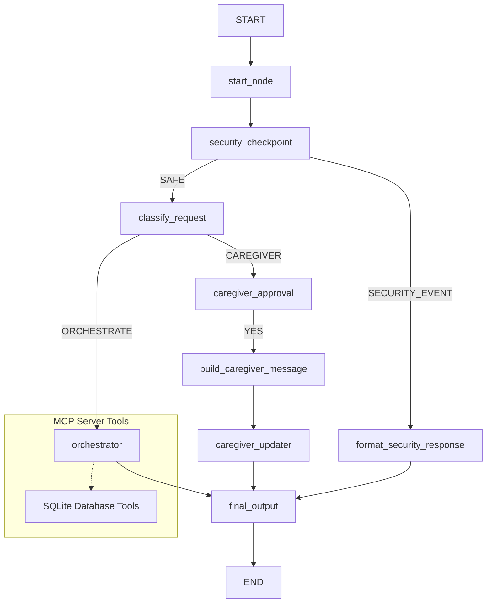

# Submission Write-Up — Elderly Care Assistant

## 1. Problem Statement

As the global population ages, millions of elderly patients struggle with daily healthcare management. Critical challenges include:
- **Medication Adherence**: Forgetting doses, taking incorrect dosages, or triggering dangerous drug-drug interactions.
- **Wellness Monitoring**: Failing to track and report daily health metrics (such as blood pressure and glucose) which could signal early health deterioration.
- **Communication Gaps**: Family members and healthcare providers often have limited visibility into daily wellness trends and emergency events.

The **Elderly Care Assistant** is a conversational concierge agent designed to bridge this gap by enabling patient-centered medication management, wellness logging, and secure caregiver communications.

---

## 2. Solution Architecture

The solution uses the Google Agent Development Kit (ADK 2.0) Graph API to orchestrate specialized LLM sub-agents, enforce strict security guardrails, and manage human approvals.

---

## 3. Concepts & ADK Features Used

- **ADK Workflow**: Implemented as the root workflow container `elderly_care_workflow` in [app/agent.py](file:///c:/Users/hafiz/Documents/AI%20Agent%20-My%20first%20project/adk-worksspace/elderly-care-assistant/app/agent.py#L282-L308) to wire multiple agent nodes and function nodes into a cohesive graph.
- **LlmAgent**: Defines specialized agents:
  - `medication_advisor`: Dedicated to medication schedule queries and interaction checks.
  - `wellness_monitor`: Log health metrics and wellness trends.
  - `caregiver_updater`: Formats caregiver updates.
  - `orchestrator`: Decides which specialist agent to consult.
- **AgentTool**: Declared in [app/agent.py](file:///c:/Users/hafiz/Documents/AI%20Agent%20-My%20first%20project/adk-worksspace/elderly-care-assistant/app/agent.py#L126-L130) to allow the main `orchestrator` to delegate sub-tasks to the specialized advisors dynamically.
- **MCP Server**: Implemented in [app/mcp_server.py](file:///c:/Users/hafiz/Documents/AI%20Agent%20-My%20first%20project/adk-worksspace/elderly-care-assistant/app/mcp_server.py) to provide access to SQLite databases with stateful CRUD operations.
- **Security Checkpoint**: The `security_checkpoint` function in [app/agent.py](file:///c:/Users/hafiz/Documents/AI%20Agent%20-My%20first%20project/adk-worksspace/elderly-care-assistant/app/agent.py#L140-L213) functions as the gatekeeper for PII scrubbing and prompt injection mitigation.
- **Agents CLI**: Used for project initialization, agent runtime config, and testing harness execution.

---

## 4. Security Design

Healthcare information is highly sensitive. The `security_checkpoint` enforces:
1. **PII Scrubbing**: Regex filters automatically scan and redact emails, phone numbers, SSNs, credit cards, and dates of birth.
2. **Injection Detection**: Prevents jailbreaking attempts (e.g., *"ignore previous instructions"*).
3. **Medical Override Guardrails**: Detects key terms like *"override medication"* to stop patients from self-prescribing or altering treatment plans through the assistant.

---

## 5. MCP Server Design

The Model Context Protocol (MCP) server provides the model with structured, secure SQLite database operations:
- **`log_health_metric`**: Logs vitals (blood pressure, glucose, pain, weight, mood) into `wellness_logs` with thresholds checked.
- **`get_medication_schedule`**: Retrieves scheduled daily doses.
- **`add_medication_reminder`**: Registers new doses and checks interaction risks.
- **`get_wellness_summary`**: Queries historical logs to report health patterns over time.
- **`check_drug_interaction`**: References a cross-interaction table to flag dangerous medication pairings.

---

## 6. Human-in-the-Loop (HITL) Flow

To prevent accidental updates or alarms from being sent to family members, the caregiver notification flow features an approval step:
- When a user asks to contact their family, the request is routed to `caregiver_approval`.
- The node yields a `RequestInput` card presenting a preview of the message.
- The workflow halts until the user replies with a clear confirmation (`YES` / `NO`), protecting the patient's privacy and avoiding false alarms.

---

## 7. Demo Walkthrough

The workflow has been verified with three core scenarios:
1. **Medication Schedule Check**: The system queries the SQLite database via MCP and successfully lists Lisinopril and Metformin schedules.
2. **Caregiver Message Interrupt**: Triggered with *"notify caregiver: feeling good today"*, which correctly pauses the graph and generates an approval dialogue.
3. **Safety Override Prevention**: A prompt trying to override prescription schedules is flagged immediately, returning an advice warning rather than executing the instructions.

---

## 8. Impact & Value Statement

The Elderly Care Assistant offers:
- **Improved Adherence**: Proactive schedule lookup and drug interaction alerts reduce medication errors.
- **Reduced Caregiver Burnout**: Proactive logging gives caregivers peace of mind and simplifies remote patient monitoring.
- **Prevention and Early Detection**: Tracking blood pressure and glucose logs helps identify dangerous trends before they become emergencies.
